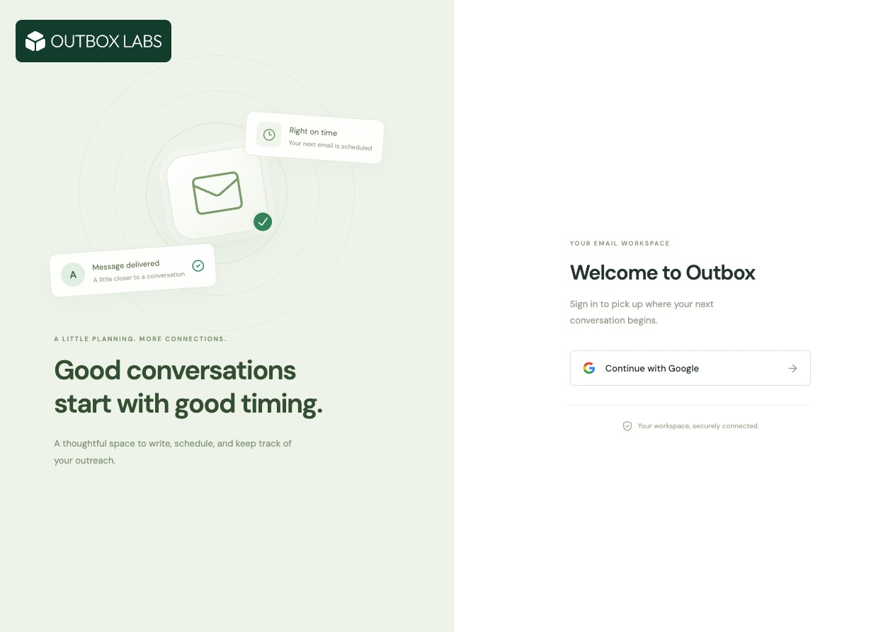
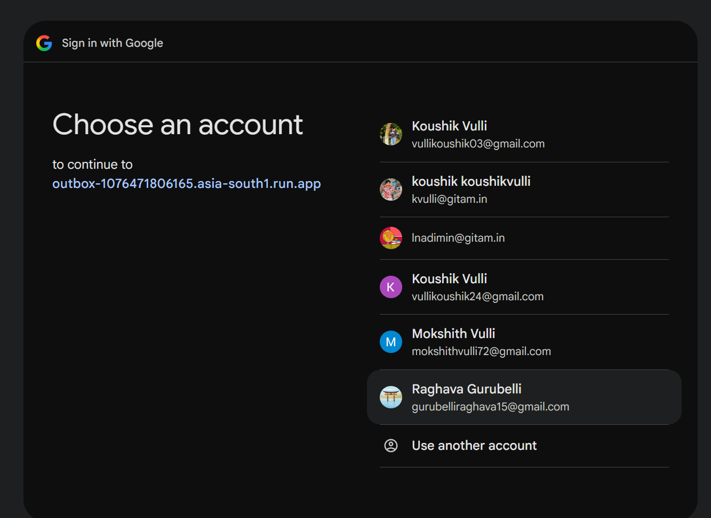
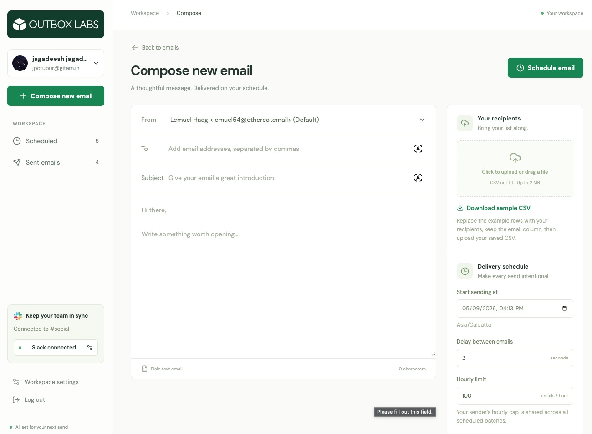
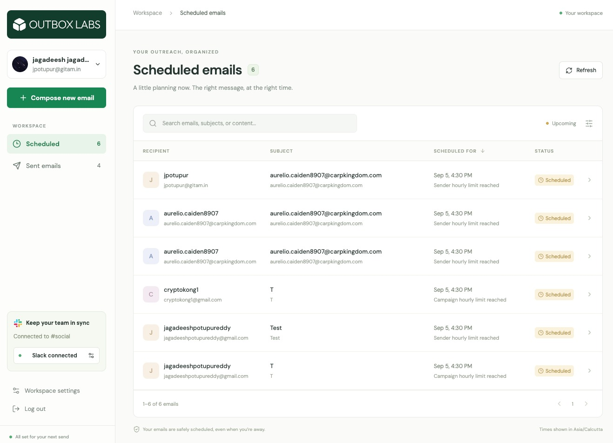
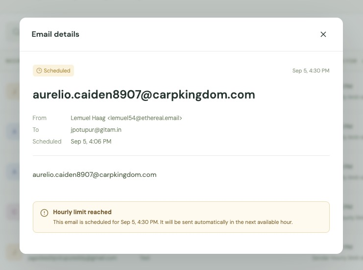
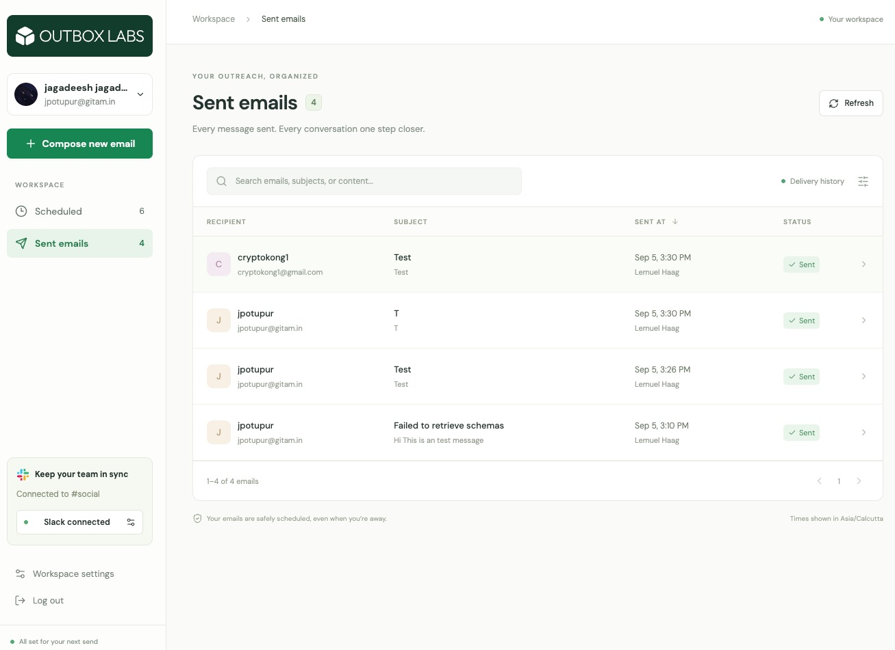
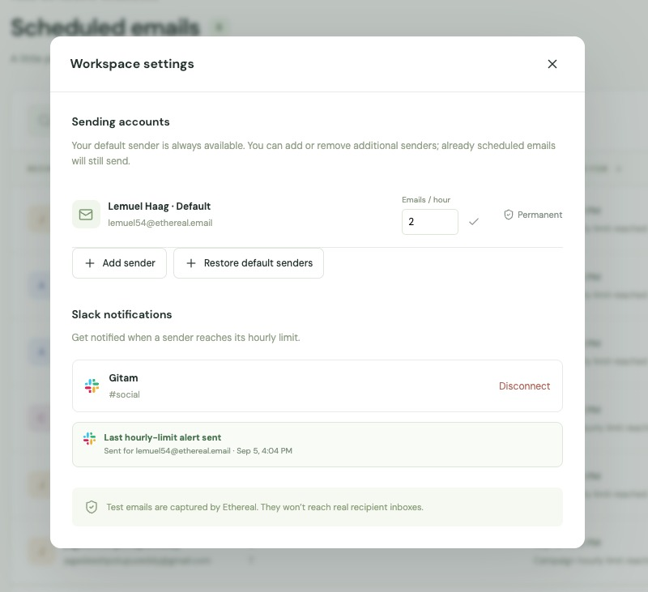
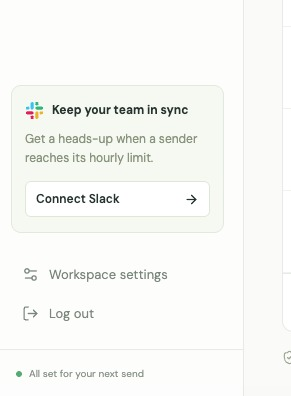

# Outbox — Full-stack email scheduler

A TypeScript email scheduling workspace built for the ReachInbox / Outbox Labs assignment. The application uses real Google OAuth, Express, BullMQ/Redis, PostgreSQL, Ethereal SMTP, Elasticsearch search, Slack OAuth notifications, and a protected live Bull Board dashboard.

Deployment: Google Cloud Run in Mumbai (`asia-south1`), with private PostgreSQL, Redis, and Elasticsearch on a GCP Compute Engine VM in `asia-south1-a`. Hosted URL: [outbox-1076471806165.asia-south1.run.app](https://outbox-1076471806165.asia-south1.run.app)

## Requirements coverage

| Requirement                   | Implementation                                                                          |
| ----------------------------- | --------------------------------------------------------------------------------------- |
| Express + TypeScript          | `server/index.ts`, input validation and owner-scoped routes                             |
| PostgreSQL                    | `server/schema.sql`, SQL transactions, row locks, persistent sessions                   |
| BullMQ + Redis                | Persistent delayed email jobs; no cron jobs                                             |
| Multiple senders              | Two verified Ethereal accounts, sender selector and ownership checks                    |
| Concurrency                   | Configurable worker concurrency, serialized sender admission in PostgreSQL              |
| Minimum delay / hourly limits | Shared per-sender and per-campaign state; fixed UTC hour windows                        |
| Restart persistence           | Redis AOF + persistent volumes, DB outbox, startup and recovery reconciliation          |
| Idempotency                   | Unique request keys, deterministic queue IDs, conditional DB delivery state             |
| Elasticsearch                 | Versioned indexing and owner-filtered recipient/subject/body search                     |
| BullMQ dashboard              | `/admin/queues`, operator-only, read-only controls                                      |
| Google login                  | Real code exchange, verified identity token, server-side session                        |
| Slack                         | Real OAuth installation, encrypted per-user webhook, durable threshold notifications    |
| Frontend                      | React/TypeScript, responsive mailbox, upload, compose, scheduled/sent views and details |
| Hosted submission             | Cloud Run HTTPS URL; custom domain unnecessary                                          |

The interface uses custom responsive CSS rather than Tailwind; the assignment permits a modern CSS implementation. Google Fonts are packaged locally and require no third-party font request.

## Reviewer walkthrough

The interface is designed to make each state understandable without opening developer tools:

1. **Sign in.** The landing screen presents the Outbox Labs identity and Google account chooser with the promise, “Good conversations start with good timing.” Google OAuth returns to a server-side session; no provider access token is exposed to the browser.
2. **Compose and import.** The compose screen keeps “Bring your list along” beside the CSV/TXT drop zone. A reviewer can download `public/templates/recipients-template.csv`, edit the `name,email` rows, upload it, and see invalid addresses and duplicates excluded before scheduling.
3. **Schedule.** The sender selector marks the permanent workspace sender as “(Default)”. The delivery panel explains the timezone, delay, and cap while the page keeps the promise, “Your emails are safely scheduled, even when you’re away.”
4. **Observe throttling.** When a cap is consumed, the scheduled list labels the affected row “Sender hourly limit reached”. Opening it shows “Hourly limit reached” and the exact next available send time; the message remains durable in PostgreSQL and is moved into the delayed BullMQ queue.
5. **Verify delivery.** The Sent emails view exposes recipient, subject, timestamp, sender, status, and an Ethereal preview link. This makes the SMTP result reviewable without pretending that Ethereal delivers to a real inbox.
6. **Verify Slack.** Workspace settings show the connected team and channel, followed by a delivery state such as “Last hourly-limit alert sent”. The state also explains when an alert is queued, waiting for Slack, or failed, so a reviewer can distinguish scheduling from notification delivery.

These phrases are product guidance shown in the UI, not claims about an external provider. The implementation details and failure semantics below explain how each state is produced.

## Product evidence

The following captures are arranged in the same order as the reviewer walkthrough. They are taken from the hosted interface and use test data; the filenames are intentionally descriptive so each artifact can be found quickly in `public/photos/`.

### 1. Branded entry point and Google authorization



The landing page establishes the product context with “Good conversations start with good timing.” The next screen keeps the provider handoff clear with Google’s “Choose an account” step.



### 2. Compose, import, and schedule



“Bring your list along” appears next to the upload zone, while the sender, timezone, delay, and hourly cap are visible before the reviewer schedules a batch.

### 3. Durable scheduling and rate-limit handling



The scheduled list makes the reason visible at row level: “Sender hourly limit reached”, alongside the persisted future send time.



Opening a row gives the unambiguous explanation, “Hourly limit reached”, followed by the exact time at which delivery will resume.

### 4. Delivery history and Slack observability



The Sent emails view provides a compact audit trail with recipient, subject, timestamp, sender, status, and Ethereal preview access.



Workspace settings show the permanent default sender, sender controls, connected Slack destination, and “Last hourly-limit alert sent” status in one place.



When Slack is not connected, “Keep your team in sync” gives the reviewer a direct **Connect Slack** action and explains why the integration matters.

## Local setup

Prerequisites: Node.js 22+, npm, Docker with Compose, and credentials for the two OAuth apps. Copy `.env.example` into ignored `.env.local` and fill in its values. Generate a random session secret and a separate 32-byte encryption key encoded as 64 hex characters. Keep the encryption key stable or saved SMTP/Slack credentials cannot be decrypted.

```sh
npm ci
docker compose -f infra/compose.yml --env-file .secrets/infra.env up -d
npm run migrate
npm run seed
npm run dev
# In another terminal:
npm run worker
# In another terminal:
npm run web
```

For local Docker, `.secrets/infra.env` must contain `POSTGRES_PASSWORD` and `REDIS_PASSWORD` matching the URLs in `.env.local`. Docker publishes data ports for local development; use local firewall controls. The GCP deployment protects these same ports with a dedicated private VPC firewall, permitting only the application subnet and authenticated SSH tunnels.

`npm run seed` reads the privately supplied `.secrets/ethereal.json` (`host`, `user`, `pass`), verifies it, creates a second Ethereal account, and stores both encrypted. For a clean clone without an existing account file, create an Ethereal account and save those three fields first. All accounts automatically receive the explicitly configured workspace defaults; the original sender appears first and is preselected. No Ethereal account-creation request runs during user setup. Credentials are never returned by APIs.

Workspace settings can remove additional senders from only the current account. The original default sender is permanent and cannot be removed. Existing campaigns and delivery history are retained. **Restore default senders** restores hidden workspace defaults without resetting quotas. Periodic loading never restores a removed additional sender.

Local app: `http://localhost:5173`. API: port 3000. Set the OAuth callback URLs to the exact routes used by your chosen origin. For Slack local development use an HTTPS origin, with the browser session and callback on that same origin, or test against Cloud Run.

Production build:

```sh
npm run build
npm start
```

Express serves the built frontend. `RUN_WORKER=true` starts worker processors in the same persistent Node process, as used on the low-cost Cloud Run deployment. The separate `npm run worker` entry point is available for independently scaling workers. Do not accidentally run additional local workers against a live production queue when testing.

## Google and Slack setup

Google uses `openid email profile`, a Web application OAuth client, and `/auth/google/callback`; no Gmail permission is requested. Set the hosted authorized redirect URI to `https://outbox-1076471806165.asia-south1.run.app/auth/google/callback`. Store credentials only in `.env.local` locally or Secret Manager in GCP. Ensure the evaluator can sign in under the OAuth app's audience configuration.

Slack uses the `incoming-webhook` scope and `/auth/slack/callback`. **Connect Slack** initiates real OAuth, lets the user select a channel, exchanges the code on the server, and encrypts the returned webhook. A manually created webhook is not a substitute for this flow. Disconnect removes the saved connection; future notification attempts check the currently connected workspace. Reconnecting needs no deploy. In the hosted deployment `SLACK_USE_DEFAULT_REDIRECT=true`, so Slack uses the first saved Redirect URL; keep exactly one saved URL and cancel any extra unsaved URL row. To install the app in a second workspace, open the app's Slack **Settings → Manage Distribution**, complete the required public/unlisted distribution checklist, and activate distribution. Slack returns `invalid_team_for_non_distributed_app` for cross-workspace installs until this is enabled; the UI now explains that exact fix.

Rate notifications contain the sender, cap, and next UTC window. They are created when the final sender allowance is consumed, once per sender/hour. A separate queue retries Slack delivery without interrupting emails. A missing Slack connection is recorded as skipped temporarily; connecting Slack republishes those skipped events so the latest alert can still be delivered. The Workspace settings dialog shows whether the latest alert is queued, sent, waiting for Slack, or failed.

## Scheduling and delivery

1. A validated `POST /api/campaigns` creates a campaign, one message per unique recipient, and durable outbox records in one PostgreSQL transaction.
2. The same `Idempotency-Key` and payload return the original campaign. Reusing it with changed content returns 409.
3. A continuously running outbox dispatcher creates delayed BullMQ jobs with deterministic email IDs. It acknowledges the DB event only after Redis confirms publication.
4. Workers read authoritative DB state and lock the sender/campaign rows before reserving a send attempt. Completed/uncertain deliveries are not automatically replayed.
5. Eligible jobs send through Ethereal. Throttled jobs move back to the delayed queue using BullMQ's `DelayedError` pattern and do not consume SMTP retry attempts.
6. Successful sends persist their SMTP message ID, timestamp and Ethereal preview URL. DB changes create versioned Elasticsearch indexing work.

PostgreSQL is the source of truth. Redis stores the actual delayed queue with AOF and `noeviction`. Both services use named volumes on persistent GCP disk. Future jobs survive API/worker restarts. If the service was offline at a due time, overdue messages run after recovery subject to throttling; the system cannot send while it is offline.

The outbox loop and stale-state reconciliation are process loops over durable state, not cron-based email scheduling. No OS cron, node-cron, Agenda, or Cloud Scheduler is used. BullMQ may contain an unused transitive parser package for its library features; this application does not configure repeatable/cron jobs.

## Rate limiting, concurrency and load

- Default `WORKER_CONCURRENCY=5`.
- Default `MIN_SEND_DELAY_MS=2000`.
- Default `MAX_EMAILS_PER_HOUR_PER_SENDER=200`; individual sender limits can be reduced in workspace settings.
- A campaign's delay and hourly allowance can be stricter than the sender settings. Sender limits remain shared across all campaigns.
- Hour windows align to UTC clock hours. This is a fixed-window limit, not a rolling 60-minute limit.
- Counters, pacing and delivery claims are in PostgreSQL transactions, not in worker-local memory.
- Only one in-flight SMTP delivery per sender is admitted. Different senders can progress concurrently. Pacing is rechecked at delivery and conservatively extended after SMTP completion.
- Shared SMTP accounts also lock the template row: pacing, in-flight delivery, and the server hourly cap apply across all users of that physical account. Each user retains separate campaigns, sender preferences, and stricter account limits.
- The quota counts admitted SMTP attempts; unsuccessful attempts may consume capacity. Successes are tracked separately in message status. This deliberately protects the cap during retries.
- Overflow remains durable and is postponed into an available window. Original sequence and time are retained; strict FIFO across concurrent campaigns/retries is not guaranteed.
- Uploads are bounded at 2 MB and campaigns at 10,000 recipients by default. The integration suite includes a 1,000-recipient persistence test with fake SMTP; the live demo uses small Ethereal batches.

Lowering a sender limit affects all pending campaigns from that sender. This can defer work. The compose hourly limit only adds a cap for that batch. To demonstrate a Slack sender-threshold alert quickly, connect Slack and set a fresh sender's cap to 3 in workspace settings before scheduling at least 4 recipients.

The reviewer-facing explanation is deliberately explicit: “Hourly limit reached” means the current window is full, and “scheduled for the next available hour” means the pending message has a persisted future `next_attempt_at`, rather than being dropped or retried in a tight loop.

## Idempotency and honest failure semantics

DB constraints, unique queue IDs and conditional state updates prevent duplicate request processing and ordinary completed-job replay. Known SMTP non-acceptance failures retry with bounded backoff; permanent rejection becomes `failed`.

Plain SMTP offers no atomic transaction with PostgreSQL. If SMTP accepts a message and the process crashes before success is recorded, the result is ambiguous. Stale in-flight records become `unknown`/Needs review and are not blindly resent. Check the Ethereal mailbox before deciding what happened. A stable Message-ID supports tracing but is not a provider deduplication guarantee. This favors avoiding duplicates over guaranteed automatic recovery of every uncertain delivery.

Slack incoming webhooks also have an acknowledgement ambiguity: durable application deduplication avoids ordinary repeated notifications, but an accepted message followed by a lost response can be repeated on retry. Exactly-once external posting is not claimed.

## Search, ownership, and operational visibility

Elasticsearch asynchronously indexes recipients, subject, body and status. External numeric versions prevent a stale scheduled update from replacing a newer sent state. Search is eventually consistent; normal lists read PostgreSQL immediately. Search queries always enforce the logged-in user's ownership. A search outage displays an error without blocking ordinary list browsing or SMTP delivery.

Bull Board is mounted at `/admin/queues` and requires a signed-in account matching `OPERATOR_EMAIL`. Its controls are read-only. Only message IDs are kept in queue payloads; SMTP and Slack secrets remain encrypted in PostgreSQL.

Sessions are persisted in PostgreSQL. Cookies are HttpOnly, SameSite=Lax and Secure on hosted HTTPS. Mutating APIs reject foreign Origin headers. OAuth state is tied to the session. The Google session is regenerated after authentication.

## API inventory

| Method | Route                                   | Purpose                                 |
| ------ | --------------------------------------- | --------------------------------------- |
| GET    | `/health/live`, `/health/ready`         | Health/readiness                        |
| GET    | `/api/config`                           | Safe public client configuration        |
| GET    | `/auth/google`, `/auth/google/callback` | Real Google login                       |
| GET    | `/api/me`                               | Profile and Slack connection            |
| POST   | `/api/logout`                           | Session logout                          |
| GET    | `/api/senders`                          | Owned sender accounts                   |
| POST   | `/api/senders/provision`                | Set up two test senders                 |
| PATCH  | `/api/senders/:id`                      | Sender hourly cap                       |
| DELETE | `/api/senders/:id`                      | Remove sender from current account      |
| POST   | `/api/leads/preview`                    | Multipart `file` CSV/text preview       |
| POST   | `/api/campaigns`                        | Durable scheduling with Idempotency-Key |
| GET    | `/api/stats`                            | Scheduled/sent/failed counts            |
| GET    | `/api/emails?view=scheduled&page=1&q=`  | Paginated list or Elasticsearch search  |
| GET    | `/api/emails/:id`                       | Owned delivery details                  |
| GET    | `/auth/slack`, `/auth/slack/callback`   | Slack installation                      |
| DELETE | `/api/integrations/slack`               | Disconnect                              |
| GET    | `/admin/queues`                         | Operator BullMQ dashboard               |

Campaign JSON: `senderId`, `subject`, `body`, `recipients`, `startAt` (ISO timestamp with timezone), `delayMs`, and `hourlyLimit`.

## Tests

```sh
npm test
npm run build
npx tsx tests/integration.ts
```

The integration runner creates a separate timestamped PostgreSQL database, uses Redis logical DB 15, and creates a separate Elasticsearch index. It clears only that isolated Redis database; do not point DB 15 at anything valuable. SMTP is replaced with a deterministic transport for integration tests, and production rejects that mode. It seeds server sessions directly in the test database to exercise authenticated APIs; it does not add a mock-login route to the application.

Coverage includes parsing, validation, API authorization, sender setup, duplicate-request races, pacing and sender caps across two workers, delayed overflow, indexing, stale update rejection, ownership, OAuth redirects/state rejection, worker restart, uncertain-send quarantine, load persistence, and logout. Separate real Google/Slack/Ethereal and browser checks are required before claiming live integration completion.

Verification completed before submission: `npm test` (13 tests), `npx tsx tests/integration.ts` (26 scenarios), hosted Ethereal smoke delivery, sender setup/remove/restore checks, and browser checks at desktop and 390px phone width. Ethereal captures assignment test mail and does not deliver it to real inboxes.

For a five-minute review, the clearest sequence is Google sign-in → download/edit/upload the sample CSV → schedule a small batch → open one deferred row → inspect the “Last hourly-limit alert sent” state in Workspace settings → open the Sent emails view and Ethereal preview. This sequence demonstrates the visible workflow, persistence, rate limiting, and Slack handoff in one pass.

## Submission

The team's main document and ClickUp form require a private GitHub repository, access for **Mitrajit** and **Yadav036**, setup/architecture README, hosted assignment URL, and a demo video no longer than five minutes. The video's required evidence includes scheduling, scheduled/sent lists, a restart, and an actual Slack limit notification. The linked older PDF has different submission-link/reviewer text; the working source is the main Notion document and its directly linked ClickUp form.

The five-minute walkthrough should show real login, two senders, CSV import, schedule a small batch, pending jobs in Bull Board, worker restart, sent mail with Ethereal preview, a low sender cap and live Slack alert, search, and the README/test evidence.

## Cost and limitations

This is a small single-VM data deployment in India. It is persistent but not highly available. VM/disk/IP and always-allocated Cloud Run CPU are billable while running; trial credit eligibility is account-specific. Cloud Run needs a minimum instance and always-allocated CPU so delayed jobs run with no web traffic. Keep resources available through review, then clean them up intentionally. Billing alerts alone are not guaranteed spending caps.

The long-form `IMPLEMENTATION_PLAN.md` records planning decisions, including the later 12-hour scope update. This README describes the implemented architecture and takes precedence where the initial plan differs.
